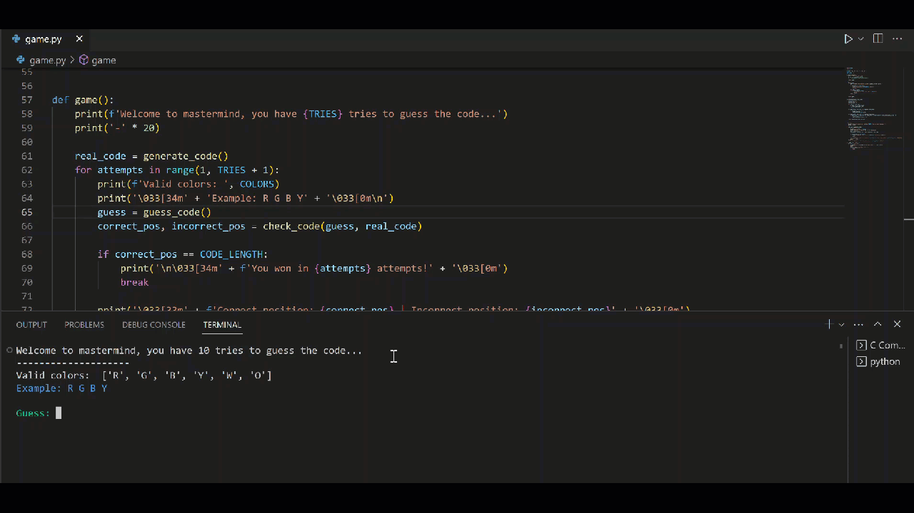

# Mastermind Game

> This is a simple Mastermind game implementation in Python. The objective of the game is to guess a secret code of four colored pegs in as few attempts as possible. The game provides feedback on the accuracy of each guess, helping the player to deduce the correct code.




## Usage

#
Run Game:

```bash
python game.py
```

## License
MIT © [iAlex0]
